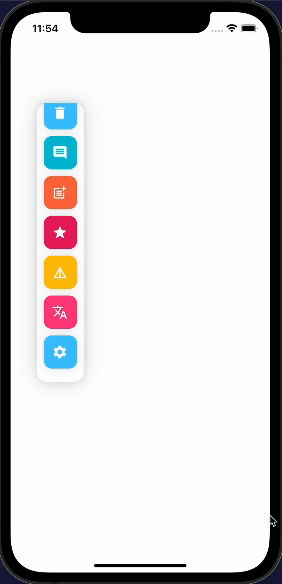

# Cool Toolbar Using Flutter

<table align="center" style="margin: 0px auto;">
  <tr>
    <td style="text-align: center;">
      

        
        
<a href="lib/main.dart" target="_blank">Flutter Cool Tab bar</a>

      

    </td>
   
  </tr>
  <tr> 
  </tr>
</table>